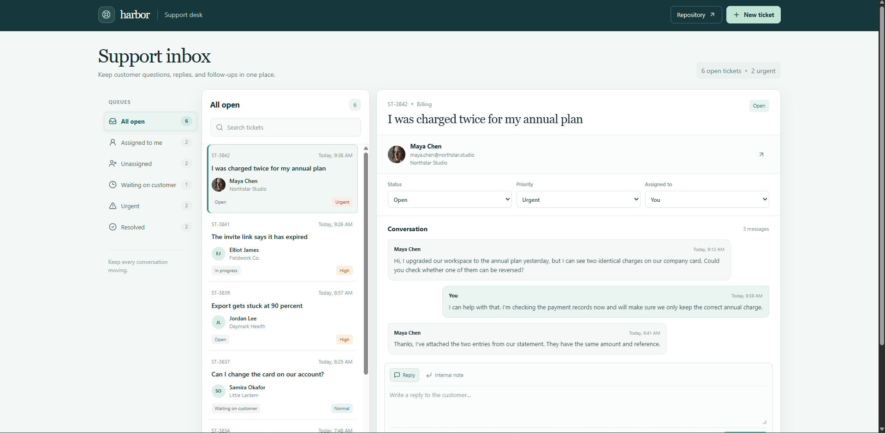



# Harbor Support Ticket Board

Harbor is a support inbox for sorting customer requests, keeping replies with their ticket, and tracking who owns the next step.

**Live app:** [https://a2rp.github.io/support-ticket-board/](https://a2rp.github.io/support-ticket-board/)

## What is included

- A fixed header with a working **New ticket** action and a link to the public source repository.
- Six queues: All open, Assigned to me, Unassigned, Waiting on customer, Urgent, and Resolved. Counts update when a ticket changes.
- Ticket search across its ID, subject, customer, and company.
- A conversation view with customer details and the complete message thread.
- Editable status, priority, and assignee fields.
- Customer replies and private team notes. Notes are marked separately in the conversation.
- A create-ticket dialog for a subject, customer name, email, company, category, priority, and first message.
- Local requester photos, keyboard-accessible controls, responsive layouts, and a floating Back to top button.

## How to use it

Choose a queue on the left to narrow the list. Search the list by ticket number, topic, customer, or company, then select a ticket to open its conversation. Use the three fields above the conversation to update its status, priority, and owner.

Choose **Reply** to add a customer-facing response or **Internal note** to add a private note for the support team. Sending a reply changes the ticket to Open. Add requests with **New ticket** in the header. New tickets start as Open and Unassigned.

## Data and limits

This is a frontend demo. The first visit loads sample tickets. Changes and new tickets are saved in this browser's local storage under harbor-support-tickets, so they stay after a reload in the same browser. They are not shared with another person, device, or browser.

Replies are saved to the local conversation only. The app does not send email, connect to a helpdesk service, or upload files. To restore the sample data, remove the harbor-support-tickets entry from this site's local storage.

## Run locally

Install Node.js and npm, then from this folder run:

```sh
npm install
npm run dev
```

Use the local URL printed by Vite.

## Lint and production build

```sh
npm run lint
npm run build
```

The production build is written to dist. Vite source maps are disabled.

## Deployment

The GitHub Pages site is published from the gh-pages branch. The deploy script publishes dist, and npm runs predeploy first to build the latest app.

```sh
npm run deploy
```

Live URL: [https://a2rp.github.io/support-ticket-board/](https://a2rp.github.io/support-ticket-board/)

## Future improvements

These are ideas for later work and are not part of the current app:

- Connect a shared backend with team sign-in and synchronized tickets.
- Send and receive customer replies through email.
- Add file uploads and attachment previews.
- Track response targets with service-level reminders.
- Add team reporting for workload and response time.

## Links

- Portfolio: [https://www.ashishranjan.net](https://www.ashishranjan.net)
- GitHub: [https://github.com/a2rp](https://github.com/a2rp)
- CodePen: [https://codepen.io/ash1198](https://codepen.io/ash1198)
- LinkedIn: [https://www.linkedin.com/in/aashishranjan](https://www.linkedin.com/in/aashishranjan)
- Facebook: [https://www.facebook.com/theash.ashish/](https://www.facebook.com/theash.ashish/)
- YouTube: [https://www.youtube.com/@ashishranjan-ashz?sub_confirmation=1](https://www.youtube.com/@ashishranjan-ashz?sub_confirmation=1)
- Email: [mailto:ash.ranjan09@gmail.com](mailto:ash.ranjan09@gmail.com)

## Support

- Support: [https://a2rp-donation-page.netlify.app/](https://a2rp-donation-page.netlify.app/)
- Buy Me a Coffee: [https://buymeacoffee.com/ashishranjan](https://buymeacoffee.com/ashishranjan)
- Patreon: [https://www.patreon.com/ashishranjan](https://www.patreon.com/ashishranjan)
